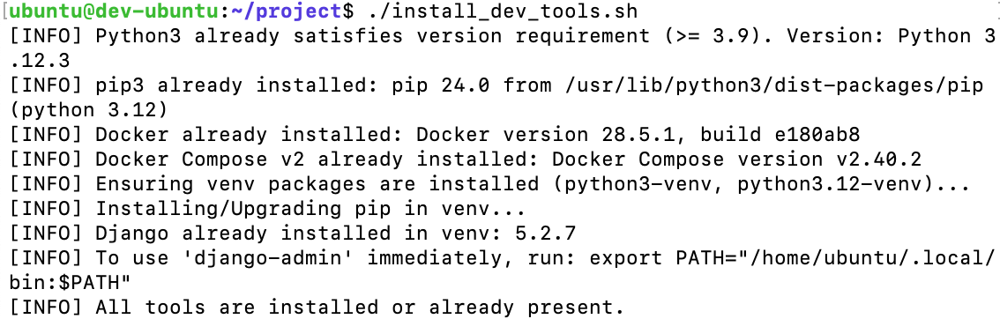

# Мікросервісний проєкт

Це репозиторій для навчального проєкту в межах курсу "DevOps CI/CD".

## Мета

Навчитися основам DevOps.

## Lesson 3

Тема «Linux адміністрування»

###

Bash-скрипт для автоматичного встановлення Docker, Docker Compose, Python і Django

###



## Як запустити (Ubuntu/Debian)

- **[вимоги]** Потрібні: apt (Ubuntu/Debian), інтернет, права sudo.
- **[кроки]**

```bash
chmod u+x install_dev_tools.sh
./install_dev_tools.sh
```

- **[що встановлюється]** Docker Engine, Docker Compose v2 (plugin), Python ≥ 3.9, Django (у venv `~/.venvs/devtools`).
- **[ідемпотентність]** Якщо інструмент уже встановлено — повторного встановлення не буде.

### Перевірка встановлення

```bash
docker --version
docker compose version
python3 --version
~/.venvs/devtools/bin/python -m django --version
```

Щоб зручно викликати `django-admin`:

```bash
echo 'export PATH="$HOME/.local/bin:$PATH"' >> ~/.profile
source ~/.profile
django-admin --version
```

### Примітки та усунення проблем

- **PEP 668 (Ubuntu 24.04+)**: системний `pip` блокує глобальні інсталяції. Скрипт встановлює Django у ізольоване venv `~/.venvs/devtools`.
- **Venv пакети**: якщо venv не створюється або немає `pip`, встановіть пакети й повторіть:

```bash
sudo apt-get update -y
sudo apt-get install -y python3-venv python3-full "python$(python3 -c 'import sys;print(f"{sys.version_info[0]}.{sys.version_info[1]}")')-venv"
./install_dev_tools.sh
```

- **Docker всередині контейнера**: у звичайному Docker-контейнері встановлення Docker Engine не працюватиме (немає systemd/привілеїв). Використовуйте повноцінну VM.

## Тестування на macOS (опційно)

Найпростіше — через Multipass (Ubuntu VM):

```bash
brew install --cask multipass
multipass launch --name dev-ubuntu --cpus 2 --mem 4G --disk 20G lts
multipass mount "/Users/<USER>/path/to/microservice-project" dev-ubuntu:/home/ubuntu/project
multipass shell dev-ubuntu
cd /home/ubuntu/project
chmod u+x install_dev_tools.sh
./install_dev_tools.sh
```
