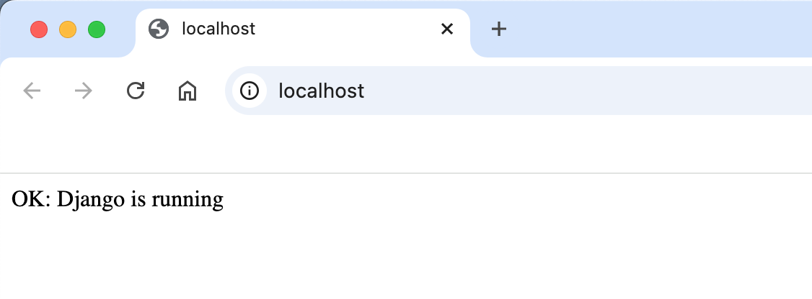

# Мікросервісний проєкт

Це репозиторій для навчального проєкту в межах курсу "DevOps CI/CD".

## Мета

Навчитися основам DevOps.

## Lesson 4

Тема «Docker»

# Django + PostgreSQL + Nginx (Docker Compose)

Мінімальний проєкт: Django вебзастосунок, база даних PostgreSQL і Nginx як реверс‑проксі. Усе контейнеризовано Docker та керується через Docker Compose.

###



## Вимоги

- Встановлені Docker Desktop з Compose

## Швидкий старт

1. Побудувати та запустити у фоні:
   ```bash
   docker compose up -d --build
   ```
2. Перевірити доступність вебзастосунку:
   - Відкрити http://localhost — має відобразитися `OK: Django is running`.

## Перевірка підключення до БД

- Міграції застосовуються автоматично при старті контейнера `django`.
- Додатково можна перевірити підключення безпосередньо до Postgres:
  ```bash
  docker compose exec db psql -U app_user -d app_db -c 'select 1;'
  # або для docker-compose v1:
  docker-compose exec db psql -U app_user -d app_db -c 'select 1;'
  ```
- А також перевірити, що Django бачить БД (через ORM):
  ```bash
  docker compose exec django python - <<'PY'
  from django.db import connection
  from django.conf import settings
  print('DB:', settings.DATABASES['default'])
  with connection.cursor() as c:
      c.execute('SELECT 1')
      print('SELECT 1 ->', c.fetchone())
  PY
  ```

## Корисні команди

- Логи сервісів:
  ```bash
  docker compose logs -f
  ```
- Зупинка і видалення контейнерів/мереж (без даних БД):
  ```bash
  docker compose down
  ```
- Повне очищення з томом БД:
  ```bash
  docker compose down -v
  ```

## Структура

- `docker-compose.yml` — сервіси: `django`, `db`, `nginx`.
- `Dockerfile` — образ для Django (Python 3.11-slim), встановлення `requirements.txt`, запуск `migrate` і `runserver`.
- `nginx/nginx.conf` — проксування на `http://django:8000`.
- `mysite/` — Django-проєкт, `settings.py` налаштований на PostgreSQL.

## Налаштування середовища (дефолтні)

- `POSTGRES_DB=app_db`
- `POSTGRES_USER=app_user`
- `POSTGRES_PASSWORD=app_pass`
- `DB_HOST=db`, `DB_PORT=5432`
