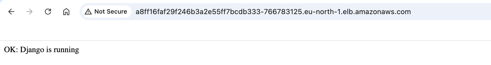
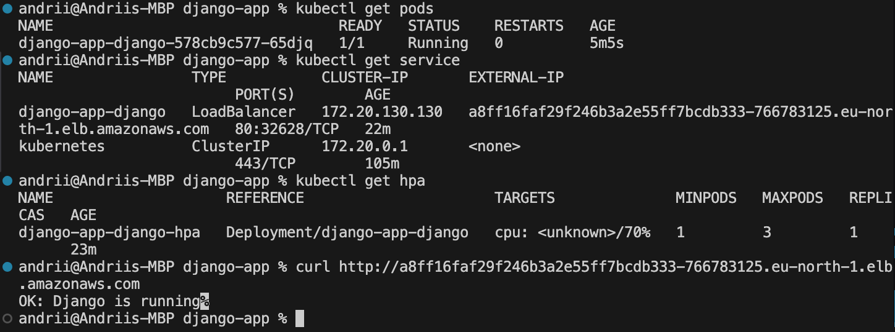

# Lesson 7: Kubernetes (EKS) + Helm для Django застосунку

Цей проєкт створює повну інфраструктуру на AWS з Kubernetes кластером (EKS) та розгортає Django застосунок за допомогою Helm.





## ⚠️ Важливо: Конфігурація для AWS Free Tier

**Цей проєкт налаштовано для роботи в межах AWS Free Tier з мінімальними ресурсами:**

- **Instance Type**: `t3.micro` (1 vCPU, 1 GB RAM) замість `t3.medium`
- **Replicas**: 1 под замість 2
- **HPA**: масштабування 1-3 поди замість 2-6
- **Resources**: CPU 100m/200m, Memory 128Mi/256Mi (зменшено)
- **Database**: SQLite замість PostgreSQL (немає окремої БД в кластері)

### Для production або не-Free Tier:

Якщо у вас **не Free Tier** або ви хочете **production-ready** конфігурацію, змініть у файлах:

**`main.tf`**:

```hcl
instance_type = "t3.medium"  # або t3.large
desired_size  = 2
max_size      = 5
```

**`charts/django-app/values.yaml`**:

```yaml
replicaCount: 2

autoscaling:
  minReplicas: 2
  maxReplicas: 6

resources:
  limits:
    cpu: 500m
    memory: 512Mi
  requests:
    cpu: 250m
    memory: 256Mi
```

## Що включено

- **Terraform інфраструктура**:

  - S3 бакет для зберігання стейт-файлів
  - DynamoDB таблиця для блокування стейтів
  - VPC з публічними та приватними підмережами
  - ECR репозиторій для Docker-образів
  - EKS кластер з worker nodes

- **Helm Chart для Django**:
  - Deployment з автоматичним масштабуванням
  - Service типу LoadBalancer
  - ConfigMap зі змінними середовища
  - HPA (Horizontal Pod Autoscaler) для масштабування від 2 до 6 подів

## Структура проєкту

```
lesson-7/
│
├── main.tf                  # Головний файл для підключення модулів
├── backend.tf               # Налаштування бекенду для стейтів (S3 + DynamoDB)
├── outputs.tf               # Загальні виводи ресурсів
├── build-and-push.sh        # Скрипт для білду та пушу Docker образу до ECR
│
├── modules/                 # Каталог з усіма модулями
│   ├── s3-backend/          # Модуль для S3 та DynamoDB
│   ├── vpc/                 # Модуль для VPC
│   ├── ecr/                 # Модуль для ECR
│   └── eks/                 # Модуль для EKS кластера
│       ├── eks.tf           # Створення EKS-кластера
│       ├── node.tf          # IAM-ролі та Node Group
│       ├── variables.tf     # Змінні для EKS
│       └── outputs.tf       # Виведення інформації про кластер
│
├── charts/                  # Helm charts
│   └── django-app/
│       ├── Chart.yaml       # Метадані Helm chart
│       ├── values.yaml      # Конфігурація та змінні середовища
│       └── templates/
│           ├── deployment.yaml   # Deployment для Django
│           ├── service.yaml      # Service типу LoadBalancer
│           ├── configmap.yaml    # ConfigMap зі змінними середовища
│           └── hpa.yaml          # Horizontal Pod Autoscaler
│
└── README.md                # Документація проєкту
```

## Вимоги

- Terraform >= 1.0
- AWS CLI налаштований з credentials
- kubectl >= 1.28
- Helm >= 3.0
- Docker
- AWS акаунт з правами на створення ресурсів

## Крок 1: Створення інфраструктури через Terraform

### 1.1. Перший запуск (створення S3 та DynamoDB)

⚠️ **ВАЖЛИВО**: При першому запуску закоментуйте `backend.tf`, оскільки S3 бакет ще не існує.

```bash
cd lesson-7

# Закоментуйте backend.tf
# Відкрийте файл і закоментуйте весь вміст

# Ініціалізація
terraform init

# Перегляд плану
terraform plan

# Застосування (створить S3, DynamoDB, VPC, ECR, EKS)
terraform apply
```

### 1.2. Налаштування бекенду

Після створення S3 та DynamoDB:

```bash
# Розкоментуйте backend.tf

# Реініціалізація з бекендом
terraform init -reconfigure
# Введіть 'yes' коли запитає про міграцію стейту
```

### 1.3. Збереження outputs

```bash
# Збережіть важливі outputs
terraform output eks_cluster_name
terraform output eks_cluster_endpoint
terraform output ecr_repository_url
```

## Крок 2: Налаштування kubectl для EKS

Після створення EKS кластера, налаштуйте kubectl:

```bash
# Оновіть kubeconfig для доступу до кластера
aws eks update-kubeconfig --region eu-north-1 --name lesson-7-eks-cluster

# Перевірте підключення
kubectl cluster-info

# Перевірте nodes
kubectl get nodes

# Перевірте всі ресурси
kubectl get all --all-namespaces
```

## Крок 3: Білд та пуш Docker образу до ECR

### 3.1. Автоматичний спосіб (рекомендовано)

Використовуйте готовий скрипт:

```bash
# Запустіть скрипт
./build-and-push.sh
```

### 3.2. Ручний спосіб

```bash
# Отримайте AWS Account ID
AWS_ACCOUNT_ID=$(aws sts get-caller-identity --query Account --output text)
ECR_URL="${AWS_ACCOUNT_ID}.dkr.ecr.eu-north-1.amazonaws.com/lesson-7-django-app"

# Логін до ECR
aws ecr get-login-password --region eu-north-1 | docker login --username AWS --password-stdin ${AWS_ACCOUNT_ID}.dkr.ecr.eu-north-1.amazonaws.com

# Білд образу
cd ../lesson-4
docker build -t lesson-7-django-app:latest .

# Тегування
docker tag lesson-7-django-app:latest ${ECR_URL}:latest

# Пуш до ECR
docker push ${ECR_URL}:latest
```

### 3.3. Перевірка образу в ECR

```bash
# Перевірте, що образ завантажено
aws ecr describe-images --repository-name lesson-7-django-app --region eu-north-1
```

## Крок 4: Оновлення values.yaml

Перед розгортанням Helm chart, оновіть `charts/django-app/values.yaml`:

```bash
# Отримайте ECR URL з Terraform outputs
ECR_URL=$(terraform output -raw ecr_repository_url)

# Оновіть image.repository у values.yaml
# Замініть на ваш ECR URL
```

Або відредагуйте вручну:

```yaml
image:
  repository: <YOUR_AWS_ACCOUNT_ID>.dkr.ecr.eu-north-1.amazonaws.com/lesson-7-django-app
  tag: latest
```

## Крок 5: Розгортання застосунку через Helm

### 5.1. Встановлення Helm chart

```bash
# Перейдіть до директорії з chart
cd charts/django-app

# Встановіть chart
helm install django-app . --namespace default

# Або з custom values
helm install django-app . --namespace default -f values.yaml
```

### 5.2. Перевірка розгортання

```bash
# Перевірте статус Helm release
helm list

# Перевірте поди
kubectl get pods

# Перевірте deployment
kubectl get deployment

# Перевірте service
kubectl get service

# Перевірте HPA
kubectl get hpa

# Перевірте ConfigMap
kubectl get configmap
```

### 5.3. Перегляд логів

```bash
# Логи подів
kubectl logs -l app=django-app-django

# Логи конкретного поду
kubectl logs <pod-name>

# Стрім логів
kubectl logs -f <pod-name>
```

### 5.4. Детальна інформація

```bash
# Детальна інформація про deployment
kubectl describe deployment django-app-django

# Детальна інформація про pod
kubectl describe pod <pod-name>

# Детальна інформація про service
kubectl describe service django-app-django
```

## Крок 6: Доступ до застосунку

### 6.1. Отримання LoadBalancer URL

```bash
# Отримайте External IP LoadBalancer
kubectl get service django-app-django

# Або з watch
kubectl get service django-app-django --watch
```

Зачекайте, поки `EXTERNAL-IP` змінить статус з `<pending>` на реальний DNS.

### 6.2. Тестування застосунку

```bash
# Отримайте URL
LOAD_BALANCER_URL=$(kubectl get service django-app-django -o jsonpath='{.status.loadBalancer.ingress[0].hostname}')

# Перевірте доступність
curl http://${LOAD_BALANCER_URL}

# Або відкрийте в браузері
echo "Open: http://${LOAD_BALANCER_URL}"
```

## Крок 7: Тестування автоматичного масштабування (HPA)

### 7.1. Перевірка HPA

```bash
# Перегляд поточного стану HPA
kubectl get hpa

# Детальна інформація
kubectl describe hpa django-app-django-hpa
```

### 7.2. Генерація навантаження (опційно)

```bash
# Запустіть pod для генерації навантаження
kubectl run -i --tty load-generator --rm --image=busybox --restart=Never -- /bin/sh

# Всередині pod виконайте
while true; do wget -q -O- http://django-app-django; done
```

### 7.3. Моніторинг масштабування

```bash
# Спостерігайте за кількістю подів
kubectl get pods --watch

# Спостерігайте за HPA
kubectl get hpa --watch
```

## Основні команди kubectl

### Перегляд ресурсів

```bash
# Всі ресурси
kubectl get all

# Поди
kubectl get pods
kubectl get pods -o wide

# Deployments
kubectl get deployments

# Services
kubectl get services

# ConfigMaps
kubectl get configmaps

# HPA
kubectl get hpa
```

### Логи та діагностика

```bash
# Логи поду
kubectl logs <pod-name>
kubectl logs <pod-name> -f  # follow

# Детальна інформація
kubectl describe pod <pod-name>
kubectl describe deployment <deployment-name>
kubectl describe service <service-name>

# Виконання команд в поді
kubectl exec -it <pod-name> -- /bin/bash
```

### Оновлення та видалення

```bash
# Оновлення deployment
kubectl apply -f deployment.yaml

# Рестарт deployment
kubectl rollout restart deployment django-app-django

# Видалення ресурсів
kubectl delete pod <pod-name>
kubectl delete deployment <deployment-name>
```

## Основні команди Helm

### Управління releases

```bash
# Список встановлених charts
helm list
helm list --all-namespaces

# Статус release
helm status django-app

# Історія release
helm history django-app
```

### Оновлення та видалення

```bash
# Оновлення release
helm upgrade django-app . -f values.yaml

# Оновлення з автоматичним встановленням
helm upgrade --install django-app . -f values.yaml

# Видалення release
helm uninstall django-app

# Видалення з очищенням історії
helm uninstall django-app --keep-history=false
```

### Тестування та валідація

```bash
# Dry-run (без реального встановлення)
helm install django-app . --dry-run --debug

# Перевірка синтаксису
helm lint .

# Рендеринг templates
helm template django-app .
```

## Оновлення застосунку

### Оновлення Docker образу

```bash
# 1. Білд нового образу
cd ../lesson-4
docker build -t lesson-7-django-app:v2 .

# 2. Тегування та пуш
docker tag lesson-7-django-app:v2 ${ECR_URL}:v2
docker push ${ECR_URL}:v2

# 3. Оновлення values.yaml
# Змініть image.tag на v2

# 4. Оновлення Helm release
cd ../lesson-7/charts/django-app
helm upgrade django-app . -f values.yaml
```

### Оновлення конфігурації

```bash
# Змініть values.yaml (наприклад, змінні середовища)

# Застосуйте зміни
helm upgrade django-app . -f values.yaml

# Перевірте, що ConfigMap оновлено
kubectl get configmap django-app-config -o yaml
```

## Очищення ресурсів

### Видалення Helm release

```bash
# Видалити Django застосунок
helm uninstall django-app
```

### Видалення Terraform інфраструктури

```bash
# Видалити всю інфраструктуру
terraform destroy

# Якщо виникає помилка з S3 (BucketNotEmpty)
# Очистіть бакет вручну
aws s3 rm s3://terraform-state-andrii-lesson7 --recursive
aws s3api delete-bucket --bucket terraform-state-andrii-lesson7 --region eu-north-1
```

## Troubleshooting

### Помилка: InvalidParameterCombination - Instance type not eligible for Free Tier

**Проблема**: Node group не створюється через помилку `The specified instance type is not eligible for Free Tier`.

**ВАЖЛИВО**: Якщо на Free Tier спробувати використати "t3.medium" - тоді отримаєте помилку про Free Tier.
Наразі instance_type в main.tf "t3.micro".

**Рішення на випадок, коли все ж запустилися з "t3.medium" на Free Tier**:

```bash
# 1. Видаліть failed node group
aws eks delete-nodegroup --cluster-name lesson-7-eks-cluster --nodegroup-name general --region eu-north-1

# 2. Зачекайте поки видалиться (1-2 хвилини)
aws eks describe-nodegroup --cluster-name lesson-7-eks-cluster --nodegroup-name general --region eu-north-1

# 3. Видаліть зі Terraform state
terraform state rm module.eks.aws_eks_node_group.general

# 4. Змініть instance_type в main.tf на t3.micro або t2.micro
# instance_type = "t3.micro"

# 5. Запустіть знову
terraform apply
```

### Помилка: ImagePullBackOff

**Проблема**: Kubernetes не може завантажити образ з ECR.

**Рішення**:

```bash
# Перевірте, що образ існує в ECR
aws ecr describe-images --repository-name lesson-7-django-app --region eu-north-1

# Перевірте IAM права worker nodes
# Node role повинна мати AmazonEC2ContainerRegistryReadOnly policy
```

### Помилка: Pods в стані CrashLoopBackOff

**Проблема**: Застосунок падає при старті.

**Рішення**:

```bash
# Перегляньте логи
kubectl logs <pod-name>

# Перевірте ConfigMap
kubectl get configmap django-app-config -o yaml

# Перевірте змінні середовища в поді
kubectl exec <pod-name> -- env
```

### Помилка: LoadBalancer в стані <pending>

**Проблема**: Service не може створити LoadBalancer.

**Рішення**:

```bash
# Перевірте events
kubectl describe service django-app-django

# Перевірте, що у вас є права на створення ELB
# Перевірте subnet tags для EKS
```

### Помилка: HPA не масштабує

**Проблема**: HPA не реагує на навантаження.

**Рішення**:

```bash
# Перевірте metrics-server
kubectl get deployment metrics-server -n kube-system

# Якщо metrics-server не встановлено
kubectl apply -f https://github.com/kubernetes-sigs/metrics-server/releases/latest/download/components.yaml

# Перевірте метрики
kubectl top pods
kubectl top nodes
```

## Як додати PostgreSQL до кластера

**Поточна конфігурація**: Django використовує SQLite (файлова БД всередині контейнера).

**Для production**: потрібно додати PostgreSQL як окремий сервіс у Kubernetes.

### Варіант 1: PostgreSQL як StatefulSet у Kubernetes

**Крок 1**: Створіть файл `charts/django-app/templates/postgres-statefulset.yaml`:

```yaml
apiVersion: v1
kind: Service
metadata:
  name: postgres
spec:
  ports:
    - port: 5432
  clusterIP: None
  selector:
    app: postgres
---
apiVersion: apps/v1
kind: StatefulSet
metadata:
  name: postgres
spec:
  serviceName: postgres
  replicas: 1
  selector:
    matchLabels:
      app: postgres
  template:
    metadata:
      labels:
        app: postgres
    spec:
      containers:
        - name: postgres
          image: postgres:16
          ports:
            - containerPort: 5432
          env:
            - name: POSTGRES_DB
              value: "app_db"
            - name: POSTGRES_USER
              value: "app_user"
            - name: POSTGRES_PASSWORD
              value: "app_pass"
          volumeMounts:
            - name: postgres-storage
              mountPath: /var/lib/postgresql/data
  volumeClaimTemplates:
    - metadata:
        name: postgres-storage
      spec:
        accessModes: ["ReadWriteOnce"]
        resources:
          requests:
            storage: 1Gi
```

**Крок 2**: Оновіть `values.yaml`:

```yaml
config:
  POSTGRES_DB: "app_db"
  POSTGRES_USER: "app_user"
  POSTGRES_PASSWORD: "app_pass"
  DB_HOST: "postgres" # ім'я сервісу PostgreSQL
  DB_PORT: "5432"
  DJANGO_SETTINGS_MODULE: "mysite.settings"
  DEBUG: "False"
  ALLOWED_HOSTS: "*"
```

**Крок 3**: Розкоментуйте PostgreSQL конфігурацію в `lesson-4/mysite/settings.py`:

```python
DATABASES = {
    'default': {
        'ENGINE': 'django.db.backends.postgresql',
        'NAME': os.environ.get('POSTGRES_DB', 'app_db'),
        'USER': os.environ.get('POSTGRES_USER', 'app_user'),
        'PASSWORD': os.environ.get('POSTGRES_PASSWORD', 'app_pass'),
        'HOST': os.environ.get('DB_HOST', 'postgres'),
        'PORT': os.environ.get('DB_PORT', '5432'),
    }
}
```

**Крок 4**: Перебілдіть та запуште образ:

```bash
cd lesson-7
./build-and-push.sh
```

**Крок 5**: Оновіть Helm release:

```bash
cd charts/django-app
helm upgrade django-app . -f values.yaml
```

### Варіант 2: Використання AWS RDS (рекомендовано для production)

**Переваги**:

- Автоматичні бекапи
- Multi-AZ для high availability
- Автоматичне оновлення
- Моніторинг через CloudWatch

**Кроки**:

1. Створіть RDS PostgreSQL через Terraform (додайте модуль `rds/`)
2. Отримайте endpoint RDS
3. Додайте endpoint у ConfigMap як `DB_HOST`
4. Переконайтеся, що Security Groups дозволяють доступ з EKS worker nodes

**Приклад Terraform для RDS**:

```hcl
module "rds" {
  source = "./modules/rds"

  db_name     = "app_db"
  db_username = "app_user"
  db_password = "secure_password_here"  # використовуйте AWS Secrets Manager

  vpc_id              = module.vpc.vpc_id
  subnet_ids          = module.vpc.private_subnets
  allowed_cidr_blocks = [module.vpc.vpc_cidr_block]
}
```

### Варіант 3: Helm Chart для PostgreSQL

Використайте готовий Helm chart від Bitnami:

```bash
# Додайте Bitnami репозиторій
helm repo add bitnami https://charts.bitnami.com/bitnami
helm repo update

# Встановіть PostgreSQL
helm install postgres bitnami/postgresql \
  --set auth.username=app_user \
  --set auth.password=app_pass \
  --set auth.database=app_db \
  --namespace default

# Отримайте пароль
export POSTGRES_PASSWORD=$(kubectl get secret --namespace default postgres-postgresql -o jsonpath="{.data.postgres-password}" | base64 -d)

# Підключення: postgres-postgresql.default.svc.cluster.local:5432
```

Потім оновіть `values.yaml`:

```yaml
config:
  DB_HOST: "postgres-postgresql.default.svc.cluster.local"
  DB_PORT: "5432"
  POSTGRES_DB: "app_db"
  POSTGRES_USER: "app_user"
  POSTGRES_PASSWORD: "app_pass"
```

### Важливо для production:

⚠️ **Не зберігайте паролі в ConfigMap!** Використовуйте Kubernetes Secrets або AWS Secrets Manager:

```yaml
# Створіть Secret
kubectl create secret generic postgres-credentials \
  --from-literal=username=app_user \
  --from-literal=password=secure_password

# У deployment.yaml використовуйте:
env:
- name: POSTGRES_USER
  valueFrom:
    secretKeyRef:
      name: postgres-credentials
      key: username
- name: POSTGRES_PASSWORD
  valueFrom:
    secretKeyRef:
      name: postgres-credentials
      key: password
```

## Корисні посилання

- [Terraform AWS Provider](https://registry.terraform.io/providers/hashicorp/aws/latest/docs)
- [EKS Documentation](https://docs.aws.amazon.com/eks/)
- [Helm Documentation](https://helm.sh/docs/)
- [Kubernetes Documentation](https://kubernetes.io/docs/)
- [kubectl Cheat Sheet](https://kubernetes.io/docs/reference/kubectl/cheatsheet/)
