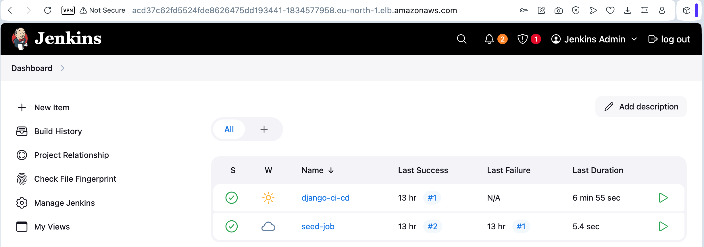
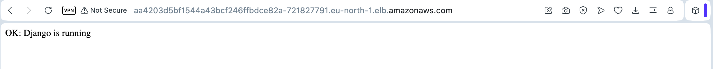
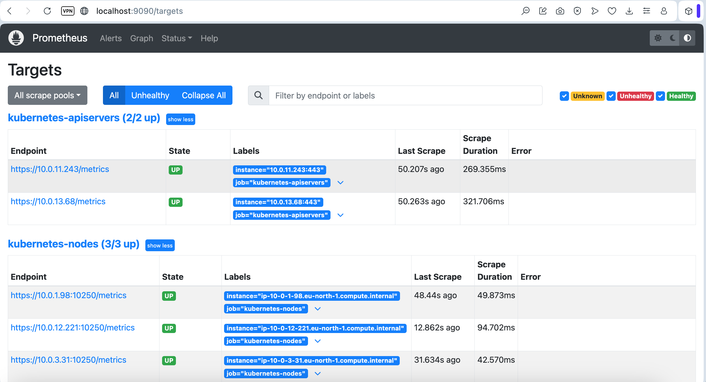
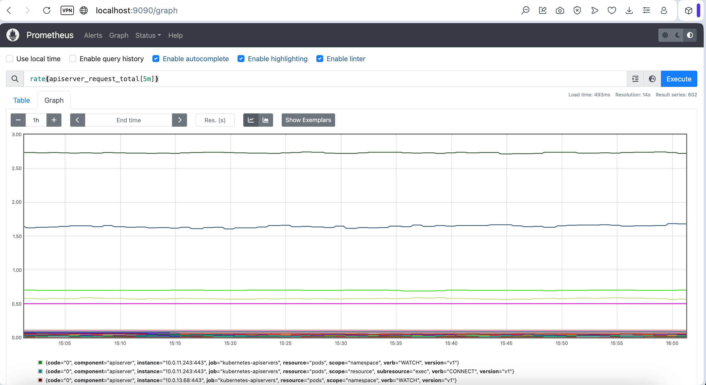
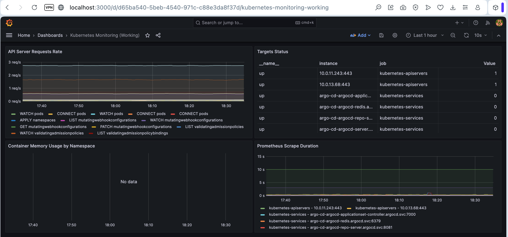

# Project: CI/CD з Jenkins + Argo CD + Terraform + Helm

Повний CI/CD pipeline для Django застосунку з автоматичним білдом, деплоєм та синхронізацією через GitOps.













## ⚠️ AWS Instance Type Configuration

**Цей проєкт налаштовано на t3.small (3 ноди)**

### Чому t3.small?

AWS Free Tier **блокує** всі non-Free-Tier інстанси (t3.medium, t2.medium) з помилкою:

```
InvalidParameterCombination - The specified instance type is not eligible for Free Tier
```

Тому використовуємо **t3.small** з оптимізацією:

- **EKS Nodes**: 3× `t3.small` (2 vCPU, 2 GB RAM)
- **RDS Instance**: `db.t3.micro` (1 vCPU, 1 GB RAM) - **Free Tier**
- **RDS Backup**: 1 день retention (Free Tier максимум)
- **PostgreSQL**: версія 16.6 (доступна для Free Tier)
- **Оптимізація**: Зменшені ресурси для всіх компонентів
- **Argo CD**: Вимкнено Dex (SSO) та Notifications
- **Storage**: EBS volumes через EBS CSI Driver

### Розподіл навантаження:

- **Нода 1**: Argo CD pods (~900 MB RAM)
- **Нода 2**: Jenkins controller (~600 MB RAM)
- **Нода 3**: Jenkins pipeline pod + Monitoring (~800 MB RAM)

**Для production** рекомендується t3.medium або більше.

## 🎯 Що реалізовано

### Інфраструктура (Terraform)

- **S3 + DynamoDB**: Backend для Terraform state
- **VPC**: Публічні та приватні підмережі
- **ECR**: Docker registry для образів
- **EKS**: Kubernetes кластер з EBS CSI Driver
- **RDS/Aurora**: PostgreSQL база даних (універсальний модуль)
- **Jenkins**: CI сервер з автоматичною конфігурацією (JCasC)
- **Argo CD**: GitOps CD інструмент з автоматичною синхронізацією
- **Prometheus + Grafana**: Моніторинг та візуалізація метрик

!!! Поточний регіон в проєкті - "eu-north-1", за потреби його можна змінити.

### CI/CD Pipeline

1. **Jenkins** збирає Docker образ через Kaniko
2. **Jenkins** пушить образ до ECR
3. **Jenkins** оновлює тег в Helm chart (values.yaml)
4. **Argo CD** автоматично виявляє зміни в Git
5. **Argo CD** синхронізує новий образ в Kubernetes

## 📁 Структура проєкту

```
project/
├── main.tf                      # Головний Terraform файл
├── backend.tf                   # S3 backend конфігурація
├── outputs.tf                   # Outputs всіх модулів
├── variables.tf                 # Змінні проєкту
├── terraform.tfvars.example     # Приклад змінних
├── Jenkinsfile                  # CI pipeline
│
├── modules/
│   ├── s3-backend/              # S3 + DynamoDB
│   ├── vpc/                     # VPC з підмережами
│   ├── ecr/                     # ECR репозиторій
│   ├── eks/                     # EKS кластер + EBS CSI Driver
│   │   ├── eks.tf
│   │   ├── node.tf
│   │   ├── aws_ebs_csi_driver.tf
│   │   ├── variables.tf
│   │   └── outputs.tf
│   ├── rds/                     # RDS/Aurora PostgreSQL
│   │   ├── rds.tf               # Звичайна RDS instance
│   │   ├── aurora.tf            # Aurora cluster
│   │   ├── shared.tf            # Спільні ресурси (SG, subnet group)
│   │   ├── variables.tf
│   │   ├── outputs.tf
│   │   └── README.md            # Документація модуля
│   ├── jenkins/                 # Jenkins з Helm + JCasC
│   │   ├── jenkins.tf
│   │   ├── values.yaml
│   │   ├── variables.tf
│   │   ├── outputs.tf
│   │   └── providers.tf
│   ├── argo-cd/                 # Argo CD з Applications
│   │   ├── argo_cd.tf
│   │   ├── values.yaml
│   │   ├── variables.tf
│   │   ├── outputs.tf
│   │   ├── providers.tf
│   │   └── charts/              # Helm chart для Argo Applications
│   │       ├── Chart.yaml
│   │       ├── values.yaml
│   │       └── templates/
│   │           ├── application.yaml
│   │           └── repository.yaml
│   └── monitoring/              # Prometheus + Grafana
│       ├── monitoring.tf        # Helm releases
│       ├── prometheus-values.yaml
│       ├── grafana-values.yaml
│       ├── variables.tf
│       ├── outputs.tf
│       ├── providers.tf
│       └── README.md            # Документація модуля
│
└── charts/
    └── django-app/              # Helm chart для Django
        ├── Chart.yaml
        ├── values.yaml
        └── templates/
            ├── deployment.yaml
            ├── service.yaml
            ├── configmap.yaml
            └── hpa.yaml
```

## 🚀 Швидкий старт

### Передумови

```bash
# Встановлені інструменти
terraform --version  # >= 1.0
aws --version
kubectl version --client
helm version
git --version

# AWS credentials налаштовані
aws configure
```

### Крок 1: Підготовка репозиторіїв

Вам потрібно **2 Git репозиторії**:

1. **Репозиторій з кодом** (Django app + Jenkinsfile)
2. **Репозиторій з Helm charts** (для Argo CD)

```bash
# Створіть 2 репозиторії на GitHub:
# 1. django-app (для коду)
# 2. helm-charts (для charts)

# Клонуйте репозиторій з кодом
git clone https://github.com/YOUR_USERNAME/django-app.git
cd django-app

# Скопіюйте Django код та Jenkinsfile
cp -r /path/to/lesson-4/* .
cp /path/to/project/Jenkinsfile .

# Commit and push
git add .
git commit -m "Initial Django app with Jenkinsfile"
git push origin main

# Клонуйте репозиторій для Helm charts
cd ..
git clone https://github.com/YOUR_USERNAME/helm-charts.git
cd helm-charts

# Створіть структуру
mkdir -p charts/django-app
cp -r /path/to/project/charts/django-app/* charts/django-app/

# Commit and push
git add .
git commit -m "Initial Helm chart for Django"
git push origin main
```

### Крок 2: Створення GitHub Personal Access Token

1. Перейдіть на https://github.com/settings/tokens
2. Generate new token (classic)
3. Виберіть scopes: `repo` (full control)
4. Збережіть токен - він знадобиться для Terraform

### Крок 3: Налаштування Terraform змінних

```bash
cd project

# Створіть terraform.tfvars з ваших даних
cp terraform.tfvars.example terraform.tfvars

# Відредагуйте terraform.tfvars
nano terraform.tfvars
```

```hcl
# terraform.tfvars
github_username = "your-github-username"
github_token    = "ghp_xxxxxxxxxxxxxxxxxxxx"
github_repo_url = "https://github.com/your-username/django-app.git"
helm_repo_url   = "https://github.com/your-username/helm-charts.git"
```

### Крок 4: Оновлення конфігурацій

#### 4.1 Оновіть ECR URL в Jenkinsfile

```bash
# Отримайте ваш AWS Account ID
AWS_ACCOUNT_ID=$(aws sts get-caller-identity --query Account --output text)
echo $AWS_ACCOUNT_ID

# Відредагуйте Jenkinsfile
nano Jenkinsfile
```

Замініть:

```groovy
ECR_REGISTRY = "YOUR_AWS_ACCOUNT_ID.dkr.ecr.eu-north-1.amazonaws.com"
```

На:

```groovy
ECR_REGISTRY = "123456789012.dkr.ecr.eu-north-1.amazonaws.com"  # ваш Account ID
```

#### 4.2 Оновіть Helm chart values.yaml

```bash
nano charts/django-app/values.yaml
```

Замініть:

```yaml
image:
  repository: YOUR_AWS_ACCOUNT_ID.dkr.ecr.eu-north-1.amazonaws.com/project-django-app
```

На:

```yaml
image:
  repository: 123456789012.dkr.ecr.eu-north-1.amazonaws.com/project-django-app
```

### Крок 5: Розгортання інфраструктури

```bash
# Перейдіть в директорію проєкту
cd project

# Ініціалізація Terraform
terraform init

# Перевірка плану
terraform plan

# Застосування (створення інфраструктури)
# ⚠️ Це займе ~15-20 хвилин
terraform apply

# Після успішного apply, розкоментуйте backend.tf
nano backend.tf  # розкоментуйте блок terraform

# Міграція state до S3
terraform init -reconfigure
```

### Крок 6: Налаштування kubectl

```bash
# Оновіть kubeconfig для доступу до EKS
aws eks update-kubeconfig --region eu-north-1 --name project-eks-cluster

# Перевірте підключення
kubectl get nodes
kubectl get pods --all-namespaces
```

### Крок 7: Доступ до Jenkins

**⚠️ Важливо:** Jenkins LoadBalancer може бути недоступний через Security Group обмеження.

**Рекомендований спосіб (port-forward):**

```bash
# Port-forward до Jenkins
kubectl port-forward -n jenkins svc/jenkins 8080:80 &

# Відкрийте в браузері
echo "Jenkins URL: http://localhost:8080"

# Логін: admin
# Пароль: admin123
```

**Альтернатива (LoadBalancer):**

```bash
# Якщо LoadBalancer доступний
JENKINS_URL=$(kubectl get svc -n jenkins jenkins -o jsonpath='{.status.loadBalancer.ingress[0].hostname}')
echo "Jenkins URL: http://$JENKINS_URL"
```

**В Jenkins UI:**

1. Перейдіть на головну сторінку
2. Знайдіть job `seed-job` (створений автоматично через JCasC)
3. Запустіть `seed-job` - він створить `django-ci-cd` pipeline
4. Запустіть `django-ci-cd` pipeline

### Крок 8: Доступ до Argo CD

```bash
# Отримайте URL Argo CD
ARGOCD_URL=$(kubectl get svc -n argocd argo-cd-argocd-server -o jsonpath='{.status.loadBalancer.ingress[0].hostname}')
echo "Argo CD URL: https://$ARGOCD_URL"

# Отримайте admin password
ARGOCD_PASSWORD=$(kubectl -n argocd get secret argocd-initial-admin-secret -o jsonpath='{.data.password}' | base64 -d)
echo "Argo CD Password: $ARGOCD_PASSWORD"

# Логін: admin
# Пароль: $ARGOCD_PASSWORD
```

**В Argo CD UI:**

1. Знайдіть application `django-app`
2. Перевірте статус синхронізації
3. Натисніть "Sync" якщо потрібно

### Крок 9: Перевірка RDS Database

```bash
# Отримайте RDS endpoint
terraform output rds_endpoint

# Отримайте connection info
terraform output -json db_connection_info

# Підключіться до БД (якщо publicly_accessible = true)
psql -h <rds-endpoint> -U postgres -d djangodb

# Або через kubectl port-forward (якщо publicly_accessible = false)
# Спочатку створіть pod для підключення
kubectl run psql-client --rm -it --image=postgres:16 -- bash
# В pod:
psql -h <rds-endpoint> -U postgres -d djangodb
```

**Примітка**: За замовчуванням `publicly_accessible = false` для безпеки.

### Крок 10: Перевірка Django застосунку

```bash
# Отримайте URL Django app
DJANGO_URL=$(kubectl get svc django-app-django -o jsonpath='{.status.loadBalancer.ingress[0].hostname}')
echo "Django URL: http://$DJANGO_URL"

# Перевірте
curl http://$DJANGO_URL
```

## 🔄 Робочий процес CI/CD

### Автоматичний деплой

1. Внесіть зміни в Django код:

```bash
cd django-app
# Змініть код
git add .
git commit -m "Update feature X"
git push origin main
```

2. Jenkins автоматично:

   - Виявить зміни в Git (через webhook або polling)
   - Запустить pipeline `django-ci-cd`
   - Зібере Docker образ через Kaniko
   - Запушить образ до ECR з новим тегом (v1.0.X)
   - Оновить `values.yaml` в helm-charts репозиторії

3. Argo CD автоматично:
   - Виявить зміни в helm-charts репозиторії
   - Синхронізує новий образ в Kubernetes
   - Оновить поди з новою версією

### Ручна синхронізація

```bash
# Через Argo CD CLI
argocd app sync django-app

# Або через UI
# Applications -> django-app -> Sync
```

## 📊 Моніторинг та перевірка

### Перевірка Jenkins pipeline

```bash
# Логи Jenkins pod
kubectl logs -n jenkins -l app.kubernetes.io/component=jenkins-controller -f

# Перевірка Service Account
kubectl get sa -n jenkins jenkins-sa -o yaml

# Перевірка IAM Role
aws iam get-role --role-name project-eks-cluster-jenkins-kaniko-role
```

### Перевірка Argo CD

```bash
# Статус applications
kubectl get applications -n argocd

# Детальна інформація
kubectl describe application django-app -n argocd

# Логи Argo CD
kubectl logs -n argocd -l app.kubernetes.io/name=argocd-server -f
```

### Перевірка Django deployment

```bash
# Поди
kubectl get pods -l app=django-app-django

# Логи
kubectl logs -l app=django-app-django -f

# HPA
kubectl get hpa

# Service
kubectl get svc django-app-django
```

## 🔧 Troubleshooting

### Jenkins не може пушити до ECR

**Проблема**: `unauthorized: authentication required`

**Рішення**:

```bash
# Перевірте IAM роль
kubectl get sa -n jenkins jenkins-sa -o yaml

# Перевірте annotations
# Має бути: eks.amazonaws.com/role-arn: arn:aws:iam::XXX:role/...

# Перевірте IAM політику
aws iam get-role-policy --role-name project-eks-cluster-jenkins-kaniko-role --policy-name project-eks-cluster-jenkins-kaniko-ecr-policy
```

### Argo CD не синхронізує зміни

**Проблема**: Application в стані `OutOfSync`

**Рішення**:

```bash
# Перевірте repository credentials
kubectl get secret -n argocd -l argocd.argoproj.io/secret-type=repository

# Перевірте логи
kubectl logs -n argocd -l app.kubernetes.io/name=argocd-repo-server

# Ручна синхронізація
kubectl patch application django-app -n argocd --type merge -p '{"operation":{"sync":{}}}'
```

### Поди не запускаються

**Проблема**: `ImagePullBackOff`

**Рішення**:

```bash
# Перевірте образ в ECR
aws ecr describe-images --repository-name project-django-app --region eu-north-1

# Перевірте image pull secrets
kubectl get pods -l app=django-app-django -o yaml | grep -A 5 imagePullSecrets

# Перевірте worker nodes IAM роль
# Має мати AmazonEC2ContainerRegistryReadOnly policy
```

### EBS CSI Driver не працює

**Проблема**: PVC в стані `Pending`

**Рішення**:

```bash
# Перевірте EBS CSI Driver addon
aws eks describe-addon --cluster-name project-eks-cluster --addon-name aws-ebs-csi-driver

# Перевірте OIDC Provider
aws iam list-open-id-connect-providers

# Перевірте Storage Class
kubectl get sc
kubectl describe sc ebs-sc
```

### RDS не підключається

**Проблема**: Django не може підключитися до RDS

**Рішення**:

```bash
# Перевірте RDS endpoint
terraform output rds_endpoint

# Перевірте Security Group
terraform output db_security_group_id
aws ec2 describe-security-groups --group-ids <sg-id>

# Перевірте чи RDS доступна з EKS nodes
kubectl run test-db --rm -it --image=postgres:16 -- bash
# В pod:
psql -h <rds-endpoint> -U postgres -d djangodb

# Якщо не підключається - перевірте Security Group rules
# Має дозволяти ingress з CIDR блоку VPC або EKS nodes
```

⚠️ **Не забудьте видалити ресурси після тестування!**

## 🧹 Очищення ресурсів

```bash
# 1. Видаліть Helm releases
helm uninstall django-app -n default
helm uninstall argo-cd-apps -n argocd
helm uninstall argo-cd -n argocd
helm uninstall jenkins -n jenkins

# 2. Почекайте поки LoadBalancers видаляться (~2 хв)
kubectl get svc --all-namespaces | grep LoadBalancer

# 3. Видаліть образи з ECR
aws ecr batch-delete-image \
  --repository-name project-django-app \
  --region eu-north-1 \
  --image-ids imageTag=latest

# 4. Terraform destroy
terraform destroy

# 5. Видаліть S3 bucket вручну (якщо потрібно)
aws s3 rb s3://terraform-state-andrii-project --force
```

**Примітка**: RDS інстанс буде видалено автоматично через `terraform destroy`. Якщо `skip_final_snapshot = false`, буде створено final snapshot перед видаленням.

## 🗄️ RDS Module - Універсальний модуль для баз даних

### Особливості модуля

Модуль `modules/rds/` підтримує:

- ✅ **RDS або Aurora** - перемикання через `use_aurora = true/false`
- ✅ **PostgreSQL та MySQL** - обидва engine
- ✅ **Multi-AZ** - для high availability
- ✅ **Автоматичні backup** - налаштовуваний retention
- ✅ **Parameter Groups** - кастомізація параметрів
- ✅ **Security Groups** - автоматичне створення
- ✅ **Encryption** - за замовчуванням увімкнено

### Приклади використання

#### Звичайна RDS PostgreSQL (поточна конфігурація)

```hcl
module "rds" {
  source = "./modules/rds"

  name                = "project-django-db"
  use_aurora          = false

  engine              = "postgres"
  engine_version      = "16.4"
  instance_class      = "db.t3.small"
  allocated_storage   = 20

  db_name             = "djangodb"
  username            = "postgres"
  password            = var.db_password

  vpc_id              = module.vpc.vpc_id
  subnet_private_ids  = module.vpc.private_subnets
  publicly_accessible = false
  multi_az            = false

  tags = {
    Environment = "dev"
  }
}
```

#### Перемикання на Aurora

Змініть в `main.tf`:

```hcl
module "rds" {
  source = "./modules/rds"

  name                          = "project-django-db"
  use_aurora                    = true  # ← Змініть на true

  # Aurora параметри
  engine_cluster                = "aurora-postgresql"
  engine_version_cluster        = "15.3"
  parameter_group_family_aurora = "aurora-postgresql15"
  aurora_replica_count          = 1  # Кількість reader реплік

  instance_class                = "db.t3.medium"  # Aurora потребує мінімум t3.medium
  # ... інші параметри
}
```

### Outputs

```bash
# RDS endpoint (якщо use_aurora = false)
terraform output rds_endpoint

# Aurora endpoints (якщо use_aurora = true)
terraform output aurora_cluster_endpoint  # Writer
terraform output aurora_reader_endpoint   # Reader

# Connection info
terraform output -json db_connection_info
```

### Детальна документація

Повна документація модуля: [`modules/rds/README.md`](modules/rds/README.md)

---

## 📊 Monitoring Module - Prometheus + Grafana

### Особливості модуля

Модуль `modules/monitoring/` забезпечує повноцінний моніторинг Kubernetes кластера:

- ✅ **Prometheus** - збір та зберігання метрик
- ✅ **Grafana** - візуалізація з pre-installed dashboards
- ✅ **Node Exporter** - метрики з Kubernetes нод
- ✅ **Kube State Metrics** - метрики Kubernetes об'єктів
- ✅ **Alertmanager** - управління алертами
- ✅ **Persistent Storage** - збереження даних через EBS
- ✅ **Resource Optimized** - налаштовано для t3.small

### Grafana Dashboards

Grafana налаштовано з Prometheus Data Source автоматично.

**Рекомендовані dashboards для імпорту:**

| Dashboard              | ID   | Опис                     |
| ---------------------- | ---- | ------------------------ |
| **Kubernetes Cluster** | 7249 | Загальний огляд кластера |
| **Kubernetes Pods**    | 6417 | Метрики подів            |
| **Node Exporter**      | 1860 | Детальні метрики нод     |

**Імпорт через UI:** Dashboards → Import → введіть ID → Load → Select Prometheus → Import

### Приклад використання

```hcl
module "monitoring" {
  source = "./modules/monitoring"

  cluster_name           = "my-eks-cluster"
  namespace              = "monitoring"
  grafana_admin_password = "SecurePassword123!"

  # Prometheus
  prometheus_retention    = "15d"
  prometheus_storage_size = "8Gi"

  # Grafana
  grafana_storage_size = "5Gi"

  # Exporters
  enable_node_exporter      = true
  enable_kube_state_metrics = true
}
```

### Доступ до сервісів

#### Prometheus

```bash
# Port-forward
kubectl port-forward -n monitoring svc/prometheus-server 9090:80

# Відкрийте в браузері
http://localhost:9090

# Перевірте targets
# Status → Targets (має бути UP: kubernetes-apiservers, kubernetes-nodes, kube-state-metrics, node-exporter)

# Приклади queries:
# count(kube_pod_info) by (namespace)
# sum(kube_pod_status_phase{phase="Running"})
# rate(apiserver_request_total[5m])
```

#### Grafana

```bash
# Port-forward
kubectl port-forward -n monitoring svc/grafana 3000:80

# Відкрийте в браузері
http://localhost:3000

# Логін
Username: admin
Password: <ваш grafana_admin_password>
```

#### Отримати пароль Grafana

```bash
# Через Terraform output
terraform output -raw grafana_admin_password

# Або через kubectl
kubectl get secret -n monitoring grafana -o jsonpath="{.data.admin-password}" | base64 --decode
```

### Outputs

```bash
# Prometheus URL
terraform output prometheus_url

# Grafana URL
terraform output grafana_url

# Port-forward команди
terraform output prometheus_port_forward
terraform output grafana_port_forward

# Повна інформація
terraform output -json monitoring_info
```

### Детальна документація

Повна документація модуля: [`modules/monitoring/README.md`](modules/monitoring/README.md)

---

## 📚 Додаткові ресурси

- [Jenkins Documentation](https://www.jenkins.io/doc/)
- [Argo CD Documentation](https://argo-cd.readthedocs.io/)
- [Kaniko Documentation](https://github.com/GoogleContainerTools/kaniko)
- [EKS Best Practices](https://aws.github.io/aws-eks-best-practices/)
- [Helm Documentation](https://helm.sh/docs/)
- [AWS RDS Documentation](https://docs.aws.amazon.com/rds/)
- [AWS Aurora Documentation](https://docs.aws.amazon.com/AmazonRDS/latest/AuroraUserGuide/)
- [Prometheus Documentation](https://prometheus.io/docs/)
- [Grafana Documentation](https://grafana.com/docs/)
- [Grafana Dashboards](https://grafana.com/grafana/dashboards/)
