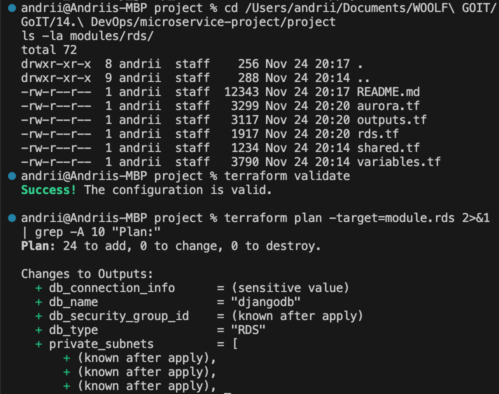

# RDS Module - Універсальний модуль для баз даних

Terraform модуль для створення RDS або Aurora PostgreSQL/MySQL баз даних в AWS.



## 🎯 Можливості

- ✅ **Підтримка RDS та Aurora** - перемикання через `use_aurora`
- ✅ **PostgreSQL та MySQL** - підтримка обох engine
- ✅ **Multi-AZ deployment** - для high availability
- ✅ **Автоматичні backup** - налаштовуваний retention period
- ✅ **Parameter Groups** - кастомізація параметрів БД
- ✅ **Security Groups** - автоматичне створення
- ✅ **Subnet Groups** - підтримка public/private subnets
- ✅ **Encryption** - storage encryption за замовчуванням
- ✅ **CloudWatch Logs** - експорт логів

## 📋 Вимоги

- Terraform >= 1.0
- AWS Provider >= 5.0
- Існуючий VPC з підмережами

## 🚀 Використання

### Приклад 1: Звичайна RDS PostgreSQL (Free Tier)

```hcl
module "rds" {
  source = "./modules/rds"

  name                       = "myapp-db"
  use_aurora                 = false

  # RDS параметри
  engine                     = "postgres"
  engine_version             = "16.4"
  parameter_group_family_rds = "postgres16"

  # Спільні параметри
  instance_class          = "db.t3.small"
  allocated_storage       = 20
  db_name                 = "myappdb"
  username                = "postgres"
  password                = var.db_password

  subnet_private_ids      = module.vpc.private_subnets
  subnet_public_ids       = module.vpc.public_subnets
  publicly_accessible     = false
  vpc_id                  = module.vpc.vpc_id

  multi_az                = false
  backup_retention_period = 7
  skip_final_snapshot     = true

  parameters = {
    max_connections            = "100"
    log_min_duration_statement = "1000"
  }

  tags = {
    Environment = "dev"
    Project     = "myapp"
  }
}
```

### Приклад 2: Aurora PostgreSQL Cluster

```hcl
module "aurora" {
  source = "./modules/rds"

  name                       = "myapp-aurora"
  use_aurora                 = true

  # Aurora параметри
  engine_cluster                = "aurora-postgresql"
  engine_version_cluster        = "15.3"
  parameter_group_family_aurora = "aurora-postgresql15"
  aurora_replica_count          = 2 # 1 writer + 2 readers

  # Спільні параметри
  instance_class          = "db.t3.medium"
  db_name                 = "myappdb"
  username                = "postgres"
  password                = var.db_password

  subnet_private_ids      = module.vpc.private_subnets
  subnet_public_ids       = module.vpc.public_subnets
  publicly_accessible     = false
  vpc_id                  = module.vpc.vpc_id

  backup_retention_period = 7
  skip_final_snapshot     = false

  parameters = {
    max_connections = "200"
  }

  tags = {
    Environment = "production"
    Project     = "myapp"
  }
}
```

### Приклад 3: RDS MySQL

```hcl
module "mysql_db" {
  source = "./modules/rds"

  name                       = "myapp-mysql"
  use_aurora                 = false

  # MySQL параметри
  engine                     = "mysql"
  engine_version             = "8.0.35"
  parameter_group_family_rds = "mysql8.0"

  # Спільні параметри
  instance_class          = "db.t3.small"
  allocated_storage       = 20
  db_name                 = "myappdb"
  username                = "admin"
  password                = var.db_password

  subnet_private_ids      = module.vpc.private_subnets
  subnet_public_ids       = module.vpc.public_subnets
  publicly_accessible     = false
  vpc_id                  = module.vpc.vpc_id

  multi_az                = true
  backup_retention_period = 7
  skip_final_snapshot     = true

  parameters = {
    max_connections = "150"
  }

  tags = {
    Environment = "staging"
  }
}
```

## 📝 Змінні

### Обов'язкові змінні

| Змінна               | Тип          | Опис                         |
| -------------------- | ------------ | ---------------------------- |
| `name`               | string       | Назва інстансу або кластера  |
| `db_name`            | string       | Назва бази даних             |
| `username`           | string       | Master username              |
| `password`           | string       | Master password (sensitive)  |
| `vpc_id`             | string       | ID VPC                       |
| `subnet_private_ids` | list(string) | Список ID приватних підмереж |
| `subnet_public_ids`  | list(string) | Список ID публічних підмереж |

### Опціональні змінні

#### Загальні

| Змінна                    | Тип         | Default         | Опис                               |
| ------------------------- | ----------- | --------------- | ---------------------------------- |
| `use_aurora`              | bool        | `false`         | Використовувати Aurora замість RDS |
| `instance_class`          | string      | `"db.t3.small"` | Клас інстансу                      |
| `publicly_accessible`     | bool        | `false`         | Публічний доступ до БД             |
| `multi_az`                | bool        | `false`         | Multi-AZ deployment                |
| `backup_retention_period` | number      | `7`             | Період зберігання backup (днів)    |
| `skip_final_snapshot`     | bool        | `false`         | Пропустити final snapshot          |
| `parameters`              | map(string) | `{}`            | Параметри для parameter group      |
| `tags`                    | map(string) | `{}`            | Tags для ресурсів                  |

#### RDS-specific

| Змінна                       | Тип    | Default        | Опис                              |
| ---------------------------- | ------ | -------------- | --------------------------------- |
| `engine`                     | string | `"postgres"`   | Database engine (postgres, mysql) |
| `engine_version`             | string | `"16.4"`       | Версія engine                     |
| `parameter_group_family_rds` | string | `"postgres16"` | Parameter group family            |
| `allocated_storage`          | number | `20`           | Розмір storage (GB)               |

#### Aurora-specific

| Змінна                          | Тип    | Default                 | Опис                          |
| ------------------------------- | ------ | ----------------------- | ----------------------------- |
| `engine_cluster`                | string | `"aurora-postgresql"`   | Aurora engine                 |
| `engine_version_cluster`        | string | `"15.3"`                | Версія Aurora engine          |
| `parameter_group_family_aurora` | string | `"aurora-postgresql15"` | Aurora parameter group family |
| `aurora_replica_count`          | number | `1`                     | Кількість reader реплік       |

## 📤 Outputs

### RDS Outputs (коли use_aurora = false)

| Output         | Опис                     |
| -------------- | ------------------------ |
| `rds_endpoint` | Endpoint для підключення |
| `rds_address`  | Hostname                 |
| `rds_port`     | Port                     |
| `rds_id`       | ID інстансу              |
| `rds_arn`      | ARN інстансу             |

### Aurora Outputs (коли use_aurora = true)

| Output                    | Опис                   |
| ------------------------- | ---------------------- |
| `aurora_cluster_endpoint` | Writer endpoint        |
| `aurora_reader_endpoint`  | Reader endpoint        |
| `aurora_cluster_id`       | ID кластера            |
| `aurora_cluster_arn`      | ARN кластера           |
| `aurora_cluster_members`  | Список членів кластера |

### Спільні Outputs

| Output              | Опис                          |
| ------------------- | ----------------------------- |
| `db_name`           | Назва БД                      |
| `db_username`       | Username (sensitive)          |
| `db_port`           | Port                          |
| `db_type`           | Тип БД (RDS/Aurora)           |
| `security_group_id` | ID security group             |
| `subnet_group_name` | Назва subnet group            |
| `connection_string` | Connection string (sensitive) |

## 🔧 Параметри БД

### PostgreSQL рекомендовані параметри

```hcl
parameters = {
  max_connections            = "100"      # Для t3.small
  shared_buffers             = "256MB"    # 25% RAM
  effective_cache_size       = "768MB"    # 75% RAM
  work_mem                   = "4MB"
  maintenance_work_mem       = "64MB"
  log_min_duration_statement = "1000"     # Log queries > 1s
  log_connections            = "1"
  log_disconnections         = "1"
}
```

### MySQL рекомендовані параметри

```hcl
parameters = {
  max_connections        = "150"
  innodb_buffer_pool_size = "268435456"  # 256MB
  slow_query_log         = "1"
  long_query_time        = "2"
}
```

## 💰 Вартість

### Free Tier (12 місяців)

- ✅ `db.t3.micro` - 750 годин/місяць
- ✅ 20 GB storage
- ✅ 20 GB backup

### Платні інстанси (eu-north-1)

| Instance Class | vCPU | RAM  | Ціна/год |
| -------------- | ---- | ---- | -------- |
| db.t3.small    | 2    | 2 GB | ~$0.034  |
| db.t3.medium   | 2    | 4 GB | ~$0.068  |
| db.t3.large    | 2    | 8 GB | ~$0.136  |

**Aurora** дорожче на ~20-30% але має кращу performance та availability.

## 🔒 Security Best Practices

1. **Ніколи не використовуйте `publicly_accessible = true` в production**
2. **Використовуйте сильні паролі** (мін. 16 символів)
3. **Зберігайте паролі в AWS Secrets Manager** або Parameter Store
4. **Увімкніть encryption** (за замовчуванням увімкнено)
5. **Обмежте Security Group** до конкретних CIDR блоків
6. **Увімкніть Multi-AZ** для production
7. **Налаштуйте backup retention** (мін. 7 днів)
8. **Не пропускайте final snapshot** в production

## 🧪 Тестування

### 1. Ініціалізація

```bash
terraform init
```

### 2. Валідація

```bash
terraform validate
terraform fmt -check
```

### 3. Plan

```bash
terraform plan
```

### 4. Apply

```bash
terraform apply
```

### 5. Підключення до БД

```bash
# Отримати endpoint
terraform output rds_endpoint

# Підключитися через psql
psql -h <endpoint> -U postgres -d djangodb

# Або через connection string
terraform output -json db_connection_info
```

## 🧹 Cleanup

```bash
# Видалити всі ресурси
terraform destroy

# Примітка: якщо skip_final_snapshot = false,
# буде створено final snapshot перед видаленням
```

## 📚 Додаткові ресурси

- [AWS RDS Documentation](https://docs.aws.amazon.com/rds/)
- [AWS Aurora Documentation](https://docs.aws.amazon.com/AmazonRDS/latest/AuroraUserGuide/)
- [PostgreSQL Parameter Reference](https://www.postgresql.org/docs/current/runtime-config.html)
- [MySQL Parameter Reference](https://dev.mysql.com/doc/refman/8.0/en/server-system-variables.html)

## 🐛 Troubleshooting

### Помилка: "DB instance already exists"

```bash
# Видаліть існуючий інстанс або змініть name
terraform state rm module.rds.aws_db_instance.standard[0]
```

### Помилка: "Invalid parameter combination"

Перевірте compatibility між `engine_version` та `parameter_group_family`.

### Помилка: "Insufficient subnet coverage"

Переконайтеся що subnet_ids охоплюють мінімум 2 availability zones.

## 📄 Ліцензія

MIT
